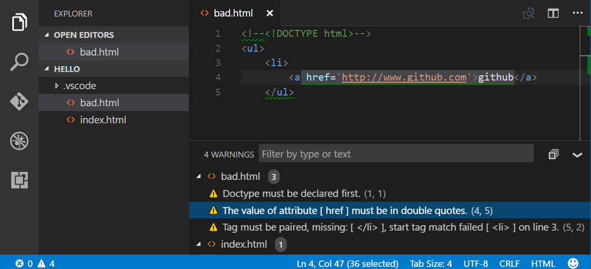
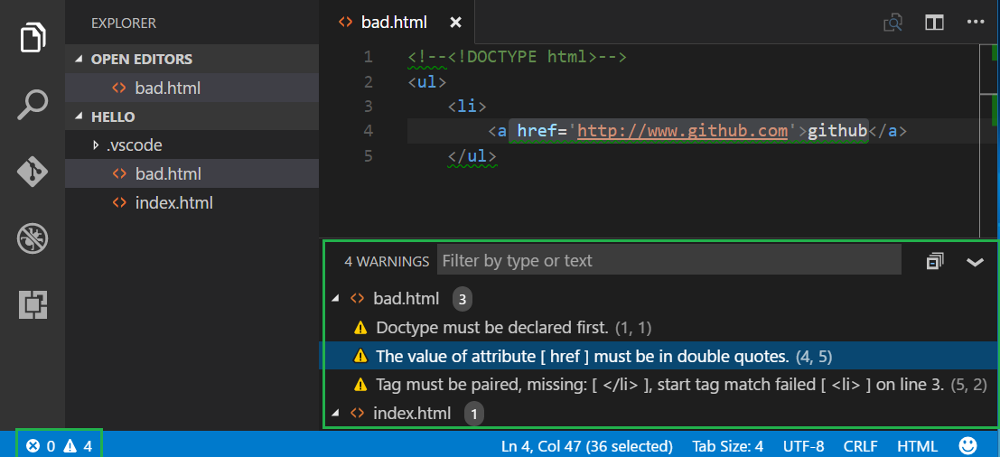
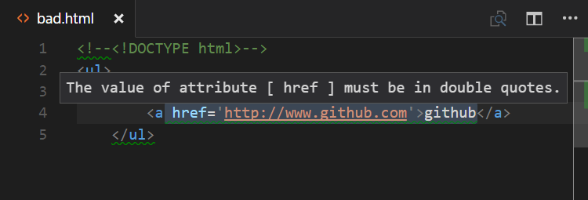

# vscode-htmlhint

Integrates the [HTMLHint](https://github.com/htmlhint/HTMLHint) static analysis tool into Visual Studio Code.



## Configuration

The HTMLHint extension will attempt to use the locally installed HTMLHint module (the project-specific module if present, or a globally installed HTMLHint module).  If a locally installed HTMLHint isn't available, the extension will use the embedded version (current version 0.11.0).

To install a version to the local project folder, run `npm install --save-dev htmlhint`.  To install a global version on the current machine, run `npm install --global htmlhint`.

## Usage

The HTMLHint extension will run HTMLHint on your open HTML files and report the number of errors on the Status Bar with details in the Problems panel (**View** > **Problems**).



Errors in HTML files are highlighted with squiggles and you can hover over the squiggles to see the error message.



>**Note:** HTMLHint will only analyze open HTML files and does not search for HTML files in your project folder.

## Rules

The HTMLHint extension uses the default [rules](https://github.com/htmlhint/HTMLHint/wiki/Usage#about-rules) provided by HTMLHint.

```json
{
    "tagname-lowercase": true,
    "attr-lowercase": true,
    "attr-value-double-quotes": true,
    "doctype-first": true,
    "tag-pair": true,
    "spec-char-escape": true,
    "id-unique": true,
    "src-not-empty": true,
    "attr-no-duplication": true,
    "title-require": true
}
```

## .htmlhintrc

If you'd like to modify the rules, you can provide a `.htmlhintrc` file in the root of your project folder with a reduced ruleset or modified values.

You can learn more about rule configuration at the HTMLHint [Usage page](https://github.com/htmlhint/HTMLHint/wiki/Usage#cli).

## Additional file types

By default, HTMLHint will run on any files associated with the "html" language service (i.e., ".html" and ".htm" files). If you'd like to use the HTMLHint extension with additional file types, you have two options:

### Option 1: Treating your file like any other html file

If you would like the file type to be treated as any other html file (including syntax highlighting, as well as HTMLHint linting), you'll need to associate the extension with the html language service.  Add the following to your VS Code [settings](https://code.visualstudio.com/docs/customization/userandworkspace), replacing `"*.ext"` with your file extension.

```json
{
  "files.associations": {
    "*.ext": "html",
  }
}
```

### Option 2:  Associating HTMLHint extension with your file type

If your file type already has an associated language service other than "html", and you'd like HTMLHint to process those file types, you will need to associate the HTMLHint extension with that language service. Add the following to your VS Code [settings](https://code.visualstudio.com/docs/customization/userandworkspace), replacing `"mylang"` with your language service.  For example, if you want HTMLHint to process `.twig` files, you would use `"twig"`. Note that with this configuration, **you need to open an html file first** to activate the HTMLHint extension. Otherwise, you won't see any linter errors, (the extension is hard-coded to activate when the html language service activates).

```json
{
  "htmlhint.documentSelector": [
    "html",
    "mylang"
  ]
}
```

## Settings

The HTMLHint extension provides these [settings](https://code.visualstudio.com/docs/customization/userandworkspace):

* `htmlhint.enable` - disable the HTMLHint extension globally or per workspace.
* `htmlhint.documentSelector` - specify additional language services to be linted
* `htmlhint.options` - provide a rule set to override on disk `.htmlhintrc` or HTMLHint defaults.
* `htmlhint.configFile` - specify a custom HTMLHint configuration file. Please specify either 'htmlhint.configFile' or 'htmlhint.options', but not both.

You can change settings globally (**File** > **Preferences** > **User Settings**) or per workspace (**File** > **Preferences** > **Workspace Settings**). The **Preferences** menu is under **Code** on macOS.

Here's an example using the `htmlhint.documentSelector` and `htmlhint.options` settings:

```json
"htmlhint.documentSelector: [
    "html",
    "htm",
    "twig"
],
"htmlhint.options": {
    "tagname-lowercase": false,
    "attr-lowercase": true,
    "attr-value-double-quotes":  true,
    "doctype-first": true
}
```

Note that in order to have the linter apply to addi
